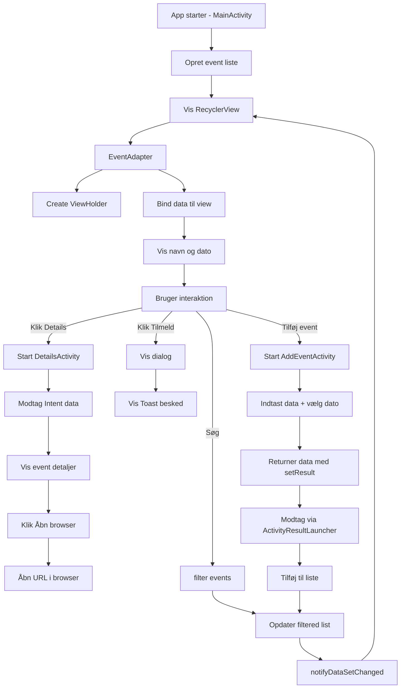

```mermaid
flowchart TD

A[App starter - MainActivity] --> B[Opret event liste]
B --> C[Vis RecyclerView]

C --> D[EventAdapter]
D --> E[Create ViewHolder]
D --> F[Bind data til view]
F --> G[Vis navn og dato]

G --> H[Bruger interaktion]

H -->|Klik Details| I[Start DetailsActivity]
I --> J[Modtag Intent data]
J --> K[Vis event detaljer]
K --> L[Klik Åbn browser]
L --> M[Åbn URL i browser]

H -->|Klik Tilmeld| N[Vis dialog]
N --> O[Vis Toast besked]

H -->|Søg| P[filter events]
P --> Q[Opdater filtered list]
Q --> R[notifyDataSetChanged]
R --> C

H -->|Tilføj event| S[Start AddEventActivity]
S --> T[Indtast data + vælg dato]
T --> U[Returner data med setResult]
U --> V[Modtag via ActivityResultLauncher]
V --> W[Tilføj til liste]
W --> Q
```

